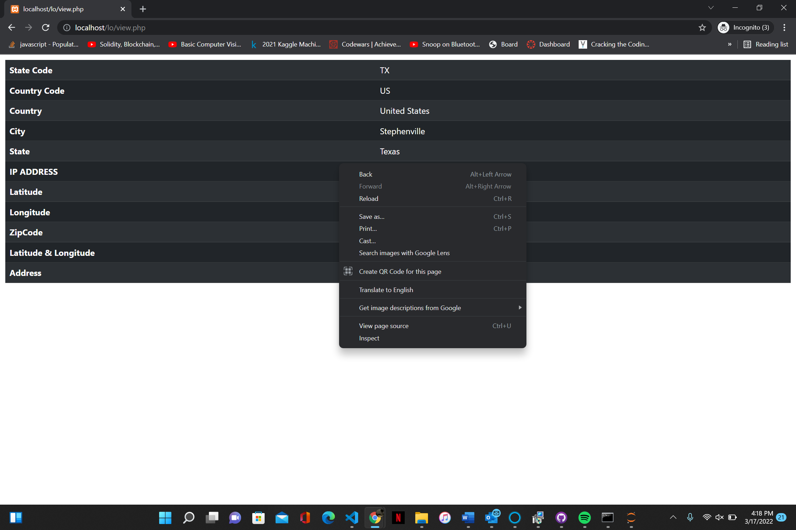

# Geo-Location Plugin PHP
Geolocation Plugin was created with PHP, it uses makes an API Call, decodes the JSON response, and gets the IP address, city, country, zip code, and state on the client-side and can be implemented and added to any project as a plugin.

